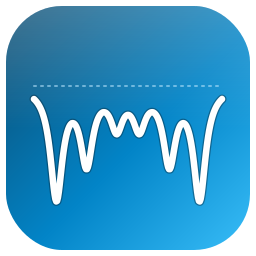
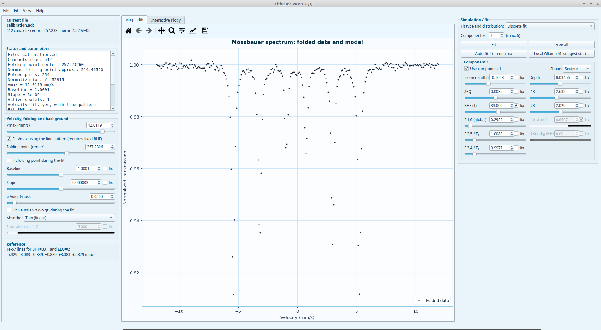
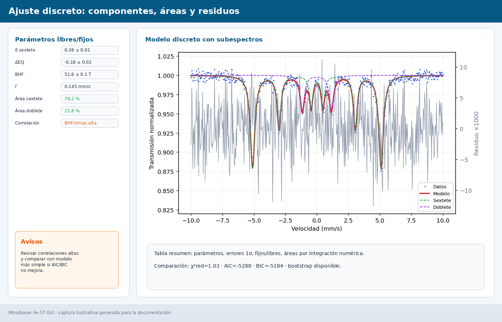
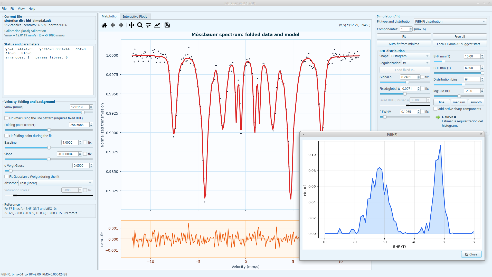
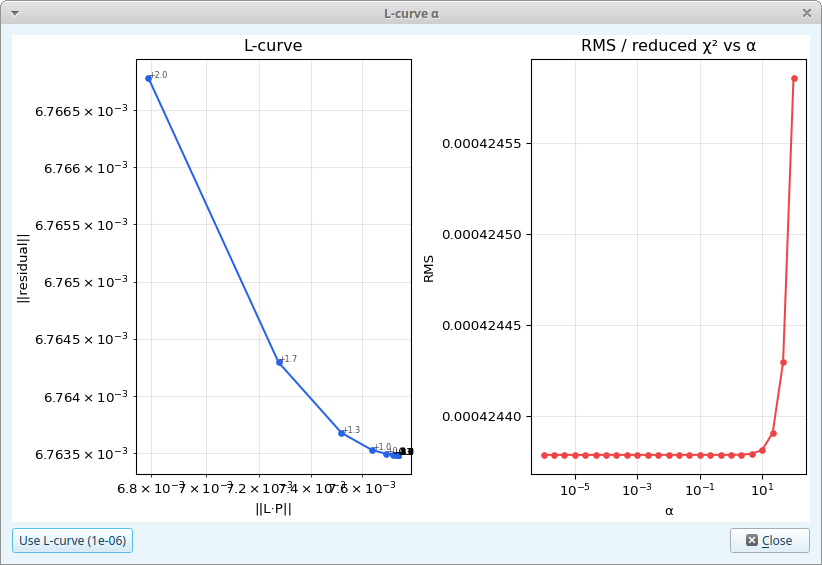
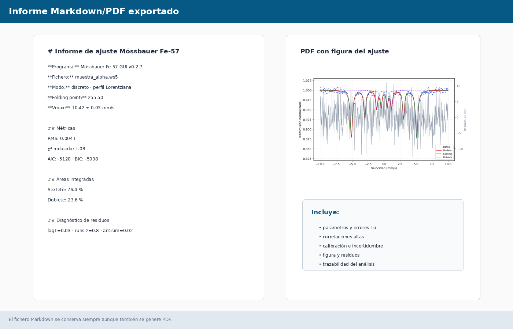

<p align="center">
  
</p>

<h1 align="center">Fitbauer</h1>

<p align="center"><b>Software for Mössbauer spectrum fitting and analysis.</b></p>


Programa de escritorio estable para cargar, doblar, simular y ajustar espectros Mössbauer de Fe-57.

Versión estable actual: **v4.0.3**.  
Arranque recomendado: `python fitbauer.py` (abre la interfaz Qt y, si no está disponible, la Tk).  
Interfaz Qt/Plotly: `mossbauer_qt.py`. Interfaz Tk: `mossbauer_app.py`.

Autor: Jorge Sánchez Marcos  
Departamento de Química Física · UAM

English version: [`README_EN.md`](README_EN.md) · Installation in English: [`INSTALL_EN.md`](INSTALL_EN.md)

## 1. Objetivo

La aplicación permite trabajar con espectros Mössbauer de Fe-57 desde la carga del fichero hasta el ajuste final. Soporta ficheros WS5 modernos y ADT antiguos sin cabecera.

Funciones principales:

- Carga local de `.ws5` y `.adt`.
- Descarga de espectros y calibraciones desde la web del laboratorio.
- Búsqueda en la lista web por muestra, fecha, id, entorno o parámetros.
- Doblado del espectro con folding point fraccionario/interpolado.
- Ajuste con singletes, dobletes y sextetes, con pesos Poisson, autoarranques, χ²/AIC/BIC, diagnóstico de residuos y errores cuando están disponibles.
- Ajuste con distribuciones `P(BHF)` y `P(ΔEQ)`, L-curve, regularización avanzada y componentes nítidos simultáneos.
- Perfiles Lorentziano y Voigt.
- Tratamiento cuadrupolar de primer orden, Kündig fijo y Kündig polvo; textura de intensidades de sextete.
- Calibración desde la web o usando el fichero actual como calibración local.
- Visualización de datos, modelo, componentes, fondo, residuo y distribución.
- Porcentajes de área de componentes, correlaciones y métricas estadísticas.
- Guardado de ajuste, guardado/carga de sesión completa e informe Markdown/PDF.
- Comprobación de nuevas versiones desde GitHub Releases y descarga de actualizaciones.
- Interfaz en español, inglés y francés; ayuda integrada en español, inglés y francés.

Datos de ejemplo incluidos:

- `data_sample/calibration.adt`: ejemplo de calibración.
- `data_sample/calibration_session.json`: sesión asociada a la calibración.
- `data_sample/Fe3O4.adt`: ejemplo de muestra Fe₃O₄.
- `data_sample/Fe3O4_session.json`: sesión asociada a la muestra Fe₃O₄.

Para probarlos, abre primero el `.adt` desde **Archivo → Cargar...** y después carga la sesión correspondiente desde **Archivo → Cargar sesión...**.


## 2. Capturas del programa

Las imágenes siguientes muestran el aspecto general de la aplicación y de algunas ventanas de análisis. Son capturas ilustrativas generadas para la documentación del repositorio.

### Pantalla principal



### Ajuste discreto



### Distribución P(BHF)



### L-curve de regularización



### Informe Markdown/PDF



## 3. Datos, folding y velocidad

El panel **Velocidad, folding y fondo** contiene:

- **Vmax**: velocidad máxima del eje, usado para construir el intervalo `-Vmax ... +Vmax`. Puede ser negativo; el signo se conserva para reproducir calibraciones web/NORMOS con eje invertido.
- **Folding point**: centro interno de simetría usado para doblar el espectro. Puede ser fraccionario, como en Normos.
- **Base**: transmisión/fondo normalizado, normalmente cercana a 1.
- **Pendiente**: término lineal del fondo.

El programa muestra también un **folding point Normos aproximado**, que suele ser aproximadamente el doble del centro interno de la GUI.

En la GUI modular se eliminan el primer y último punto del espectro doblado, porque los canales extremos suelen ser menos fiables. El eje de velocidades se trata de forma conservadora: primero se construye el eje completo `linspace(-Vmax, +Vmax, N)` y después se recortan las mismas posiciones que en los datos (`[1:-1]`). No se reconstruye un eje nuevo entre `-Vmax` y `+Vmax` con menos canales, porque eso estiraría la escala y sesgaría `BHF`.

## 4. Modelo discreto

Cada una de las tres pestañas de componente puede ser:

### Singlete

Una línea única. Parámetros principales: `δ`, `Γ`, profundidad e intensidad.

### Doblete

Dos líneas separadas por `ΔEQ`. Útil para fases paramagnéticas con interacción cuadrupolar.

### Sextete

Seis líneas magnéticas. Parámetros principales:

- `δ`: desplazamiento isomérico.
- `ΔEQ`: cuadrupolo de primer orden.
- `BHF`: campo hiperfino en teslas.
- `Γ 1,6`: anchura HWHM de las líneas exteriores.
- `Γ 2,5 rel` y `Γ 3,4 rel`: anchuras relativas.
- `Profundidad`: escala global de absorción. Por defecto empieza en `0.02`; la barra de la GUI va de `0` a `0.07`, pero el ajuste interno permite valores mayores.
- `I1`/`int1` ≈ `D13` e `I2`/`int2` ≈ `D23`: intensidades relativas respecto a las líneas 3,4.
- `int3`: no aparece en la GUI; queda fijo internamente a `1` siguiendo la convención NORMOS.

El botón **Ajuste** optimiza todos los parámetros no fijados. Si hay varios componentes activos, el panel de estado muestra el porcentaje de área integrada de cada uno y, si se puede calcular la covarianza, su error 1σ.

## 5. Distribución P(BHF)

El modo **Distribución P(BHF)** modela el espectro como una suma de muchos sextetes con distintos campos hiperfinos. El resultado es una distribución `P(BHF)`, que representa el peso espectral asociado a cada campo.

### Método usado

Se usa un ajuste tipo Hesse-Rübartsch:

- Se define una malla de campos entre `B mín` y `B máx`.
- Cada punto de la malla aporta un sextete con ese `BHF`.
- Los pesos de la distribución son no negativos.
- Se penaliza la segunda diferencia de `P(BHF)` para evitar oscilaciones no físicas.

De forma esquemática se minimiza:

```text
residuo espectral² + α · rugosidad(P)²
```

### Parámetros de distribución

- **δ global**: desplazamiento isomérico común para todos los sextetes de la distribución.
- **ΔEQ global**: cuadrupolo común.
- **Γ HWHM**: anchura común de línea.
- **B mín / B máx**: intervalo de campos hiperfinos considerados.
- **Bins BHF**: número de puntos de la malla. Más bins dan más resolución pero pueden introducir ruido.
- **log10 α**: logaritmo del parámetro de regularización.

Interpretación de `α`:

- `α` pequeño: distribución más detallada, pero sensible al ruido.
- `α` grande: distribución más suave, pero puede ocultar estructura real.

Los botones **fino**, **medio** y **suave** son presets de `α`. El botón **L-curve α** calcula una curva de compromiso entre residuo y rugosidad para sugerir un valor razonable.

### Componentes nítidos

La opción **sumar componentes activos nítidos** permite mezclar una distribución con fases discretas. Por ejemplo, una fase amplia distribuida más una fase de Fe metálico con `BHF ≈ 33 T`.

En ese modo:

- `P(BHF)` se ajusta y regulariza.
- Los componentes activos se suman como singlete/doblete/sextete nítidos.
- Sus amplitudes se ajustan, pero no forman parte de la regularización.

### Refinar δ y Γ globales

La opción **refinar δ y Γ globales** intenta optimizar también el desplazamiento isomérico y la anchura global de la distribución. Es útil, pero puede aumentar correlaciones; conviene usarla después de elegir un rango BHF y un `α` razonables.

### Consejos prácticos

- Empieza con un intervalo amplio, por ejemplo `0–50 T`.
- Si aparece peso artificial cerca de 0 T, sube `B mín`.
- Usa `α` medio y luego revisa la L-curve.
- No interpretes detalles muy estrechos si `α` es demasiado pequeño.
- Si una fase es claramente discreta, añádela como componente nítido.

## 6. Actualizaciones

El programa comprueba nuevas versiones publicadas en GitHub Releases al arrancar y también manualmente desde:

```text
Ayuda → Buscar actualizaciones...
```

La versión local está definida en `APP_VERSION`. Si existe una release con un tag superior, por ejemplo `v2.3`, el programa ofrece descargarla en `Descargas`/`Downloads`. Si la descarga es un ZIP de GitHub, puede descomprimirlo automáticamente en la misma carpeta del programa; después basta con reiniciar.

El historial de versiones está en `CHANGELOG.md`.

## 7. Instalación desde código

Se puede instalar sin `.exe` con Python:

```bash
python3 install.py
./fitbauer         # Qt por defecto; cae a Tk si PySide6 no está disponible
./fitbauer --tk    # fuerza la interfaz Tk
```

En Windows:

```bat
py install.py
fitbauer.bat
fitbauer.bat --tk
```

Ambas interfaces comparten el mismo núcleo de cálculo (`core/`): física,
ajuste, bootstrap y verosimilitud perfilada. Elige la que prefieras.

### Construir ejecutables (PyInstaller)

```bash
pyinstaller Fitbauer.spec       # ejecutable Qt (principal)  -> dist/Fitbauer/
pyinstaller Fitbauer-Tk.spec    # ejecutable Tk (respaldo)   -> dist/Fitbauer-Tk/
```

Más detalles en `INSTALL.md`.

## 8. Guardado

### Guardar ajuste

Guarda datos, curva ajustada, residuo y cuentas dobladas. En modo distribución también guarda `P(BHF)` y metadatos del ajuste.

### Guardar sesión

Guarda un JSON con:

- ruta del fichero,
- cuentas,
- parámetros,
- componentes activos,
- parámetros fijos,
- opciones,
- covarianza y errores del último ajuste,
- texto del panel **Estado y parámetros**.

### Opciones automáticas

Al cerrar, el programa guarda opciones persistentes en:

```text
~/.config/mossbauer_fe33_gui/settings.json
```

## 9. Panel Estado y parámetros

Este panel resume el estado del ajuste: fichero, folding, normalización, Vmax, fondo, RMS, parámetros, porcentajes de área, errores y parámetros fijados. En modo distribución muestra además el rango BHF, número de bins, α, pico de P(BHF) y porcentajes de distribución/componentes nítidos.
