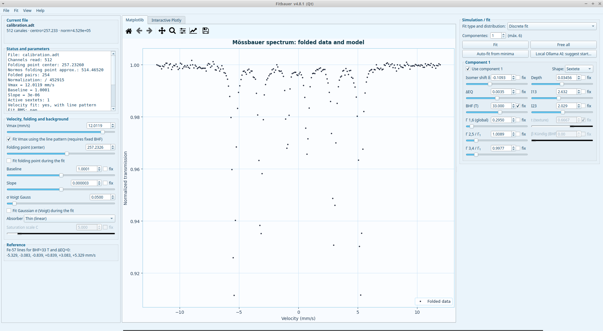
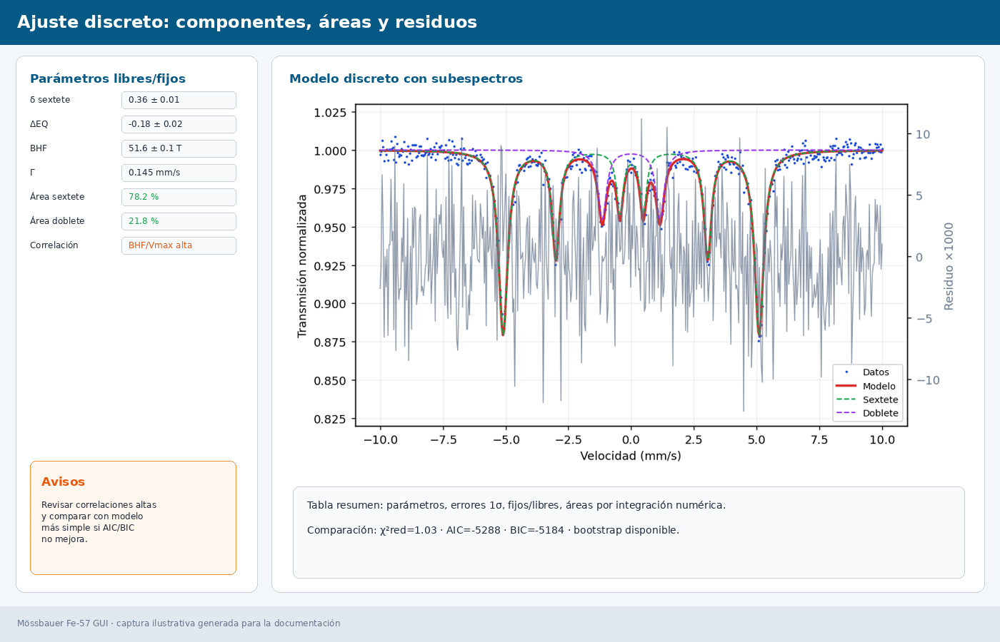
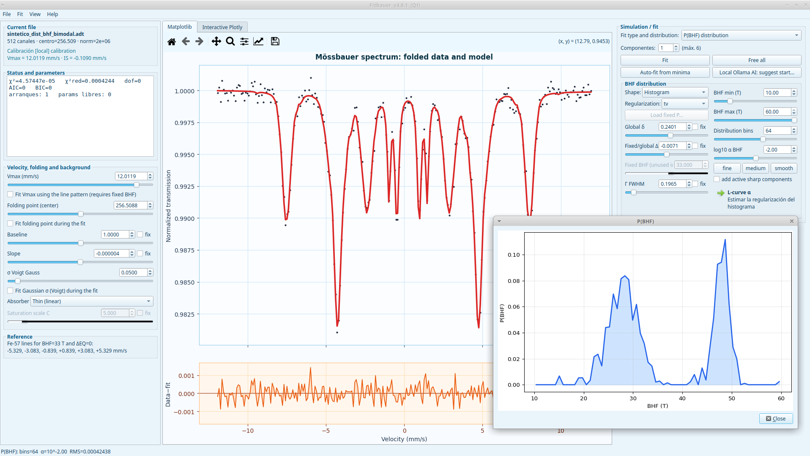
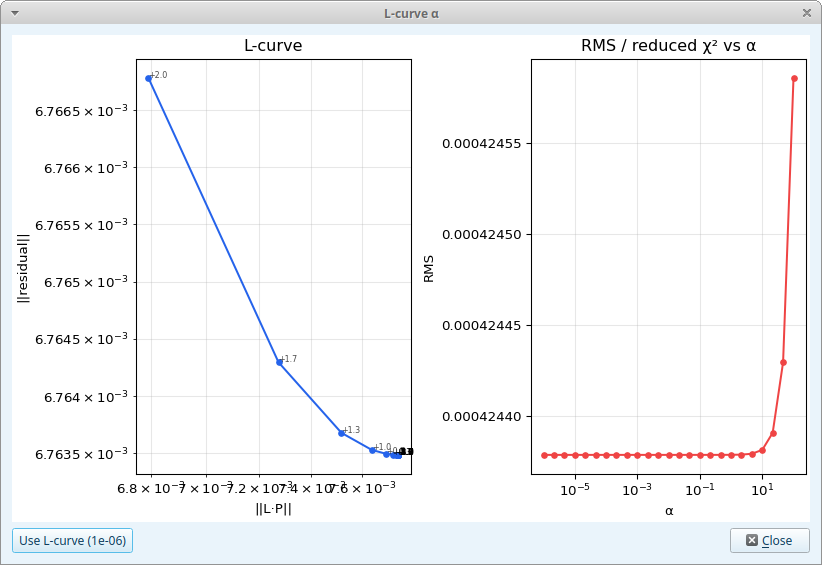
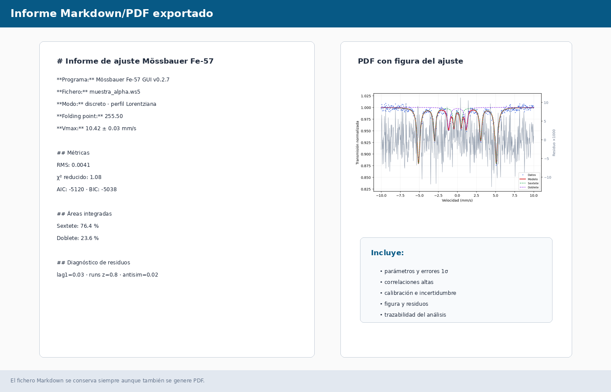

<p align="center">
  
</p>

<h1 align="center">Fitbauer</h1>

<p align="center"><b>Software for Mössbauer spectrum fitting and analysis.</b></p>

<p align="center">
  <a href="README_ES.md">🇪🇸 Versión en español</a>
</p>

<p align="center">
  
  
  
  
</p>

Stable desktop application to load, fold, simulate and fit ⁵⁷Fe Mössbauer spectra.

Current stable version: **v5.0.0**  
Launch: `python fitbauer.py`  
Headless CLI fitting: `mossbauer_fit_cli.py` (discrete) · `fit_bhf_distribution_cli.py` (distributions)

**Authors:** Jorge Sánchez Marcos · Nieves Menéndez González  
Department of Physical Chemistry · UAM

---

## Fitbauer and NORMOS

NORMOS (R. A. Brand, 1990-1994) is the program behind a large part of the
published Mössbauer literature. It runs under DOS, it is proprietary and it is
no longer maintained. Fitbauer exists so that this body of work —and those
files— can **keep being used** from a current, open, cross-platform program.

That demands two things: producing the same numbers as NORMOS, and speaking its
file format. Both have been verified against the original program.

### Validated against NORMOS, with numbers

Fitbauer's physics has been checked on two independent benchmarks.

**1. Synthetic benchmark.** NORMOS generates a spectrum from known parameters,
Fitbauer fits it, and the result is compared with the truth.

| | spectra | fits | comparisons |
|---|---|---|---|
| Round-trip NORMOS → Fitbauer | 411 | ~1,150 | 6,497 |

Median deviation from the true value:

| Block | position | BHF | linewidth |
|---|---|---|---|
| First-order sextet/doublet | 2·10⁻⁷ mm/s | 4·10⁻⁵ T | 8·10⁻⁷ mm/s |
| Full Hamiltonian | 6·10⁻⁵ mm/s | 8·10⁻⁴ T | 5·10⁻⁴ mm/s |
| Texture and intensities | 2·10⁻⁷ mm/s | 2·10⁻³ T | 2·10⁻⁵ mm/s |
| Multi-site and constraints (up to 10 sites) | 2·10⁻⁴ mm/s | 2·10⁻⁴ T | 2·10⁻⁴ mm/s |

In the first-order core the agreement is **exact** to numerical precision. The
residual tail in the Hamiltonian case is the approximation made by NORMOS 1994
itself, not by Fitbauer.

**2. Real-job benchmark.** 564 fits performed in NORMOS over the years —not
synthetic: laboratory measurements, with their models and their results—
reloaded into Fitbauer and reproduced.

- In **355 of 503** comparable jobs (**71 %**) Fitbauer matches or improves on
  NORMOS's reduced χ².
- Median reduced χ²: NORMOS **2.433** · Fitbauer **2.089**.
- Parameter agreement, over the jobs that reproduce:

  | δ | ΔEQ | BHF | Γ | area |
  |---|---|---|---|---|
  | 0.0011 mm/s | 0.0019 mm/s | 0.017 T | 0.030 mm/s | 0.0036 |

Among those that do not reproduce, in **22 cases NORMOS had converged to
something unphysical** —linewidths below the natural one, negative areas— which
Fitbauer cannot replicate because it enforces physical bounds.

The full reports, job by job, are in
[`validacion/informe/`](validacion/informe/).

### Opens and writes `.JOB` files

**File ▸ NORMOS (.JOB)**

- **Import** rebuilds the model **and loads its spectrum**: a `.JOB` names its
  files in the header, and Fitbauer looks for them next to it. Both
  **NORMOS-SITE** jobs (discrete sites) and **NORMOS-DIST** jobs (distributions)
  work; the latter are detected automatically and open the P(BHF)/P(ΔEQ) panel.
- **Export** writes the current model in NORMOS format. **NORMOS has been
  verified to accept the file Fitbauer produces**, reproducing the original
  theory with a difference of exactly zero.
- The delicate convention conversions —`WID`/`W13` widths versus Γ₁, `D13`/`D23`
  area ratios versus depth ratios, the global numbering of `NDEX` constraints—
  are handled automatically, and the importer **warns about everything it could
  not carry over**.

Fitbauer **does not run NORMOS and does not ship it**: it only speaks its text
format, which is not proprietary.

### What Fitbauer does that NORMOS does not

| | NORMOS | Fitbauer |
|---|---|---|
| **2D distributions** | — | P(BHF,ΔEQ), P(IS,ΔEQ), P(BHF,IS) |
| **Regularizers** | Tikhonov and maximum entropy | plus **total variation** (edge-preserving) |
| **Choosing α** | by hand | L-curve and GCV criterion, with exportable table |
| **P(IS)** | singlet kernel | singlet, doublet or sextet kernel |
| **Distribution shapes** | histogram, Gaussian, binomial | plus multi-Gaussian VBF (Rancourt–Ping) |
| **Errors** | covariance matrix | plus Monte Carlo bootstrap and asymmetric profile-likelihood intervals |
| **Minimum search** | single start | multi-start and automatic global escalation (differential evolution) |
| **Series of spectra** | one file at a time | **sequential batch fitting** with warm start |
| **Superparamagnetism** | — | Néel–Arrhenius with lognormal size distribution and **global multi-temperature fit** |
| **Voigt profile** | approximate pseudo-Voigt | exact Voigt |
| **Diagnostics** | χ² | plus residual tests (lag-1, runs, antisymmetry), correlations and insufficient-grid warning |
| **Outputs** | text | Markdown/PDF reports, TSV with subspectra and complete JSON session |
| **Headless use** | — | CLI for discrete and distribution fits |
| **Platform** | DOS | Windows, macOS and Linux |
| **Languages** | English | 8 languages, with integrated help |
| **Licence** | proprietary | Apache 2.0, open source |

Several parts of the calculation are also measurably more accurate: Hamiltonian
diagonalisation in double precision (Hermitian LAPACK versus general EISPACK in
`REAL*4`), a source kernel integrated over each channel instead of sampled, and
cubic interpolation when folding instead of truncating to a whole channel.

### What it still does not do

Stated just as plainly. None of this blocks routine ⁵⁷Fe work, but it is worth
knowing:

- **⁵⁷Fe only.** NORMOS also handles ¹¹⁹Sn, ¹⁹⁷Au, ¹⁵¹Eu and ¹²¹Sb.
- **Analytical Czjzek / Le Caër distributions.** The histogram reproduces their
  shape, but there is no 2-3 parameter closed form to fit directly.
- **External field in Ising relaxation** (`BEXT`): population polarization is
  there; the line shift it causes is not.
- **Emission spectra** (source in the sample).
- **Two overlapping distribution blocks**, each with its own grid. Fitbauer
  handles one, plus sharp components.
- **Octet** (ΔmI = ±2): modelled as a sextet plus two singlets, not as a
  component of its own.
- **Preprocessing**: channel rebinning, adding several spectra or rescaling
  counts.
- When importing a distribution `.JOB`, the **`LAMDA` smoothing parameter is not
  carried over**: NORMOS's is absolute and Fitbauer's is dimensionless, so it has
  to be set with the L-curve.

The complete inventory, capability by capability and with the exact NORMOS source
reference, is in
[`validacion/informe/COVERAGE_NORMOS_EN.md`](validacion/informe/COVERAGE_NORMOS_EN.md);
what remains, with what to touch and how to validate it, is in
[`PENDING_NORMOS_EN.md`](validacion/informe/PENDING_NORMOS_EN.md).

---

## Features

- Load local `.ws5` and `.adt` files; download measurements and calibrations from the laboratory web database.
- Spectrum folding with a fractional folding point and cubic interpolation.
- **Discrete fitting** — singlets, doublets and sextets; Lorentzian/Voigt profiles; Poisson or Gaussian likelihood; robust loss functions; χ²/AIC/BIC.
- **Multi-start fitting** with configurable restarts and Monte Carlo bootstrap errors.
- **Profile-likelihood confidence intervals** with adaptive scan.
- **Distribution fitting** — `P(BHF)`, `P(ΔEQ)`, `P(IS)` and three 2D modes (`P(BHF,ΔEQ)`, `P(IS,ΔEQ)`, `P(BHF,IS)`); Hesse-Rübartsch regularization; L-curve α estimation; simultaneous sharp components.
- Advanced quadrupole: first-order, fixed Kündig, powder Kündig; sextet intensity texture.
- Physical constraint presets (3:2:1 powder, tied widths, linked δ/Γ across components).
- Relaxation models: phenomenological, Blume–Tjon two-state, Néel–Arrhenius with lognormal size distribution.
- Parameter limits fully configurable through the GUI (View → Parameter limits…).
- Interactive Matplotlib figure with semi-manual minimum editor.
- Batch fitting across a series of files with warm-start.
- Fit export as TSV with **per-component subspectra** and an informative header.
- Markdown/PDF reports: full report and condensed short report.
- Complete JSON session save/load; persistent settings across restarts.
- Update checking and one-click download from GitHub Releases.
- Interface and integrated help in **English**, Spanish, French, German, Portuguese, Russian, Japanese and Chinese.

---

## Screenshots

> The interface language is English by default.

### Main window



### Discrete fit (doublets)



### Hyperfine-field distribution P(BHF)



### Regularization L-curve



### Short Markdown/PDF report



---

## Quick start

```bash
python3 -m venv .venv
source .venv/bin/activate          # Windows: .venv\Scripts\activate
pip install -r requirements.txt
python fitbauer.py
```

Try the included sample data:

1. **File → Open…** → `data_sample/magnetita_Fe3O4.adt`
2. **File → Load session…** → `data_sample/Fe3O4_session.json`

Typical workflow:

```
Open spectrum → check folding/Vmax → choose model → fit
  → inspect residuals/areas → export session/report
```

---

## Fitting modes

### Discrete fit

Up to three simultaneous components (singlet / doublet / sextet). Each component has independent type, parameters and fixed/free status. The **Fit** button optimises all free parameters; the status panel reports integrated areas, covariance errors or bootstrap errors (Monte Carlo), and fit statistics.

For sextets the main parameters are:

| Parameter | Meaning |
|-----------|---------|
| δ (IS) | Isomer shift (mm/s) |
| ΔEQ | First-order quadrupole splitting (mm/s) |
| BHF | Hyperfine field (T) |
| Γ 1,6 | HWHM of outer lines (mm/s) |
| Γ 2,5 rel / Γ 3,4 rel | Relative widths of lines 2,5 and 3,4 |
| Depth | Global absorption amplitude |
| int1 / int2 | Relative intensities (≈ D13, D23); int3 fixed to 1 |

### Distribution P(BHF) / P(ΔEQ)

Models the spectrum as a sum of many sextets (or doublets) on a regular grid. The Hesse-Rübartsch-style optimisation minimises:

```
weighted spectral residual² + α · roughness(P)²
```

Use **L-curve α** to find a good compromise between residual and smoothness. The **Add active sharp components** option mixes the distribution with discrete phases (e.g. a broad distribution + metallic Fe at BHF ≈ 33 T).

### Relaxation models

| Type | Description |
|------|-------------|
| Relajacion | Phenomenological blocked/superparamagnetic interpolation |
| BlumeTjon | Dynamic two-state ±BHF exchange |
| NeelSize | Néel–Arrhenius + lognormal size distribution |

---

## Installation

See [`INSTALL_EN.md`](INSTALL_EN.md) for full installation instructions.

Build a standalone executable with PyInstaller:

```bash
pyinstaller Fitbauer.spec    # → dist/Fitbauer/
```

---

## Project structure

```
core/          Physics and fitting engine (no GUI dependency)
gui/           Modular Qt/Matplotlib GUI — thin controllers only
locales/       Translations: en / es / fr / de / pt / ru / ja / ch
data_sample/   Sample spectra and sessions
tests/         Physics, fitting, CLI and Qt tests
```

The physics and fitting engines live exclusively in `core/`; the GUI is a thin client. See [`docs/architecture.md`](docs/architecture.md) for details.

---

## Changelog

See [`CHANGELOG.md`](CHANGELOG.md).

---

## License

© Jorge Sánchez Marcos, Nieves Menéndez González — Department of Physical Chemistry, UAM.
