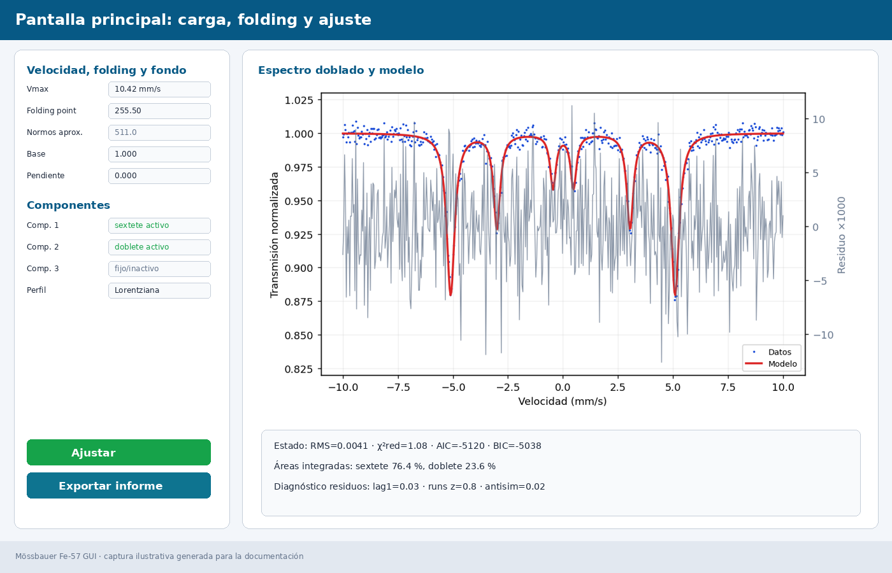
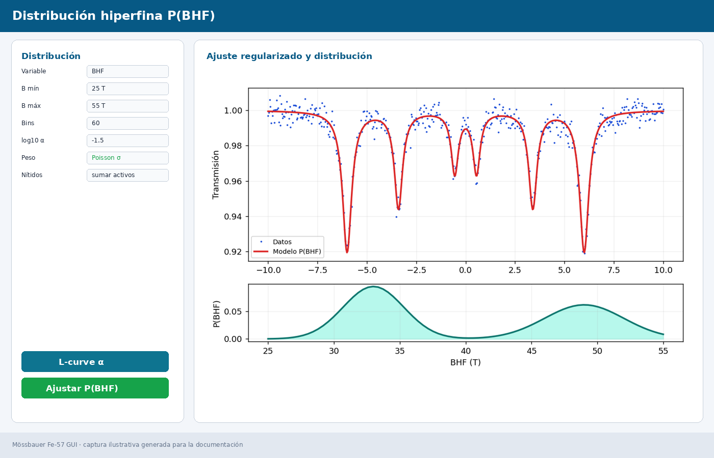
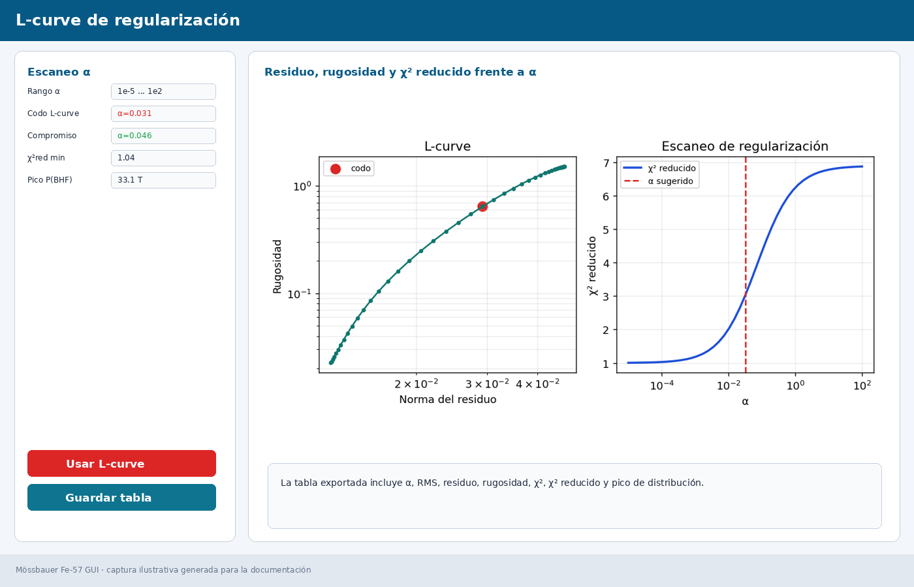

# Mössbauer Fe-57 GUI

Stable desktop application to load, fold, simulate and fit 57Fe Mössbauer spectra.

Current stable version: **v2.2**. Test prerelease: **v2.3-beta1**.  
Main application: `mossbauer_fe33_gui_v2IA.py`.

Author: Jorge Sánchez Marcos  
Department of Physical Chemistry · UAM

Spanish README: [`README.md`](README.md)

## 1. Purpose

The application covers the complete analysis workflow, from loading the spectrum to saving the final fit and a documented report. It supports modern WS5 files and older ADT count files.

Main features:

- Local loading of `.ws5` and `.adt` files.
- Download of measurements and calibrations from the laboratory web database.
- Spectrum folding with fractional/interpolated folding point.
- Discrete fitting with singlets, doublets and sextets.
- Hyperfine-field distribution fitting, `P(BHF)`.
- Quadrupole-splitting distribution fitting, `P(ΔEQ)`.
- Lorentzian and Voigt profiles.
- Poisson-weighted fits, reduced χ², AIC and BIC.
- Numerical component areas, parameter correlations and residual diagnostics.
- Deterministic multi-start fitting and Monte Carlo bootstrap errors for discrete fits.
- Advanced quadrupole treatment: first order, fixed Kündig and powder Kündig.
- Sextet intensity texture mode and physical constraint presets.
- Optional folding-point and Vmax fitting.
- Local or web-based calibration metadata.
- Markdown/PDF report export.
- Complete JSON session save/load.
- Update checking through GitHub Releases.
- Spanish, English and French interface/help.

Included sample data:

- `data_sample/calibration.adt`: calibration example.
- `data_sample/calibration_session.json`: session associated with the calibration.
- `data_sample/Fe3O4.adt`: Fe₃O₄ sample example.
- `data_sample/Fe3O4_session.json`: session associated with the Fe₃O₄ sample.

To try them, first open the `.adt` file from **File → Open...** and then load the corresponding session from **File → Load session...**.

Future-comparison documents:

- [`PROPUESTAS_SYNCMOSS.md`](PROPUESTAS_SYNCMOSS.md): proposed future improvements after comparison with SyncMoss.
- [`PROPUESTAS_NORMOS.md`](PROPUESTAS_NORMOS.md): proposed compatibility and validation work against NORMOS.

## 2. Screenshots

### Main window



### Discrete fit


### Hyperfine-field distribution P(BHF)



### Regularization L-curve



### Markdown/PDF report


## 3. Data, folding and velocity

The **Velocity, folding and background** panel contains:

- **Vmax**: maximum velocity used to build the `-Vmax ... +Vmax` axis. It may be negative; the sign is preserved to reproduce web/NORMOS calibrations with reversed velocity direction.
- **Folding point**: internal symmetry center used to fold the spectrum. Fractional values are supported, as in NORMOS.
- **Baseline**: normalized transmission/background, normally close to 1.
- **Slope**: linear background term.

The program also displays an approximate **NORMOS folding point**, usually about twice the GUI internal center.

The modular GUI removes the first and last folded points because edge channels are often less reliable. The velocity axis is handled conservatively: the full `linspace(-Vmax, +Vmax, N)` axis is built first and then the same `[1:-1]` positions are trimmed in both data and velocity. A shorter axis is not rebuilt between `-Vmax` and `+Vmax`, because that would stretch the scale and bias `BHF`.

## 4. Discrete model

Each of the three component tabs can be configured as:

- **Singlet**: one line.
- **Doublet**: two lines separated by `ΔEQ`.
- **Sextet**: six magnetic lines with `δ`, `ΔEQ`, `BHF`, widths, depth and relative intensities. Component-1 depth starts at `0.02`; the GUI depth slider is `0–0.07`, while the internal fit bound remains wider. Intensities follow the NORMOS convention: `int3` is hidden/fixed to `1`, and the visible controls are `int1≈D13` and `int2≈D23`.

The **Fit** button optimizes all non-fixed parameters. The status panel reports integrated areas, errors when available, fit statistics and residual diagnostics.

## 5. Distribution P(BHF) / P(ΔEQ)

Distribution mode models the spectrum as a sum of many sextets or doublets over a regular grid. The Hesse-Rübartsch-style regularization penalizes excessive curvature of the distribution:

```text
weighted spectral residual² + α · roughness(P)²
```

The **L-curve α** tool scans regularization values and helps choose a physically reasonable compromise between residual and smoothness.

## 6. Saving and reports

The program can save:

- A text fit export, `.dat`.
- A complete JSON session, `.json`.
- A Markdown report and, optionally, a PDF report.

The report includes program version, file traceability, folding point, Vmax, calibration metadata, fit statistics, parameters, errors, areas, correlations and residual diagnostics.

## 7. Installation

See [`INSTALL_EN.md`](INSTALL_EN.md) for English installation instructions, or [`INSTALL.md`](INSTALL.md) for Spanish instructions.

Quick start from source:

```bash
python3 -m venv .venv
source .venv/bin/activate
pip install -r requirements.txt
python mossbauer_fe33_gui_v2IA.py
```
